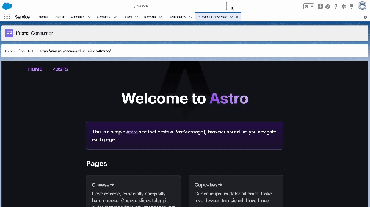

# LWC iframe communication

This project demonstrates how consume `postMessage()` browser api calls from a child iframe. This work builds upon Christophe Coenraets work in [Salesforce Developers Blog - Communicating between Lightning Components and Visualforce Pages](https://developer.salesforce.com/blogs/developer-relations/2017/01/lightning-visualforce-communication)

In this example, a static website sends a `postMessage()` call upon each page load. The call includes a simple object that contains the url of the current page. Upon receipt of this call, the `currentIframeUrl` variable is updated and printed to the parent LWC component.



## Setup and Deployment

- Set your target org
- `sf project deploy start`
- `sf org open -p lightning/n/Iframe_Consumer`
- Navigate across iframed site

## Iframed Content

The iframed site is a simple static website built with Astro. Full source for the iframed site can be found at [https://github.com/mvogelgesang/astroIframe](https://github.com/mvogelgesang/astroIframe).

The specific code that is sending the `postMessage()` call is below and is included in the `<head>` of the site. 

⚠️⚠️ As noted in the comments, if implementing such a pattern in production, "*" should instead be a valid domain or domain pattern.

```html
<script>
  window.addEventListener("load", () => {
    const data = { location: window.location.href };
    // normally, you would enter a trusted domain or pattern as the second argument.
    // since this is a demo and nothing sensitive is shared, "*" is used
    window.parent.postMessage(data, "*");
  });
</script>
```
